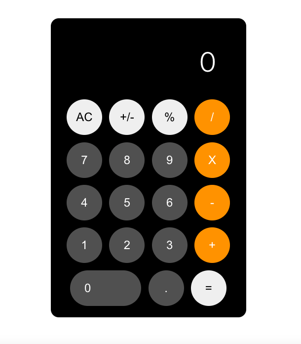

# Calculator
It is a simple application of a calculator with css based on the ios calculator /
[DEMO](https://gabinamu.github.io/calculator/)

<div align="center">

</div>

## Run Locally:
- First clone the repository into your machine;

```
git clone git@github.com:GabiNamu/calculator.git
```
- Go to the project directory;

```
cd calculator
```

- Install dependencies;

```
npm install
```
- Start the server;
```
npm start
```

## Main technologies used:


